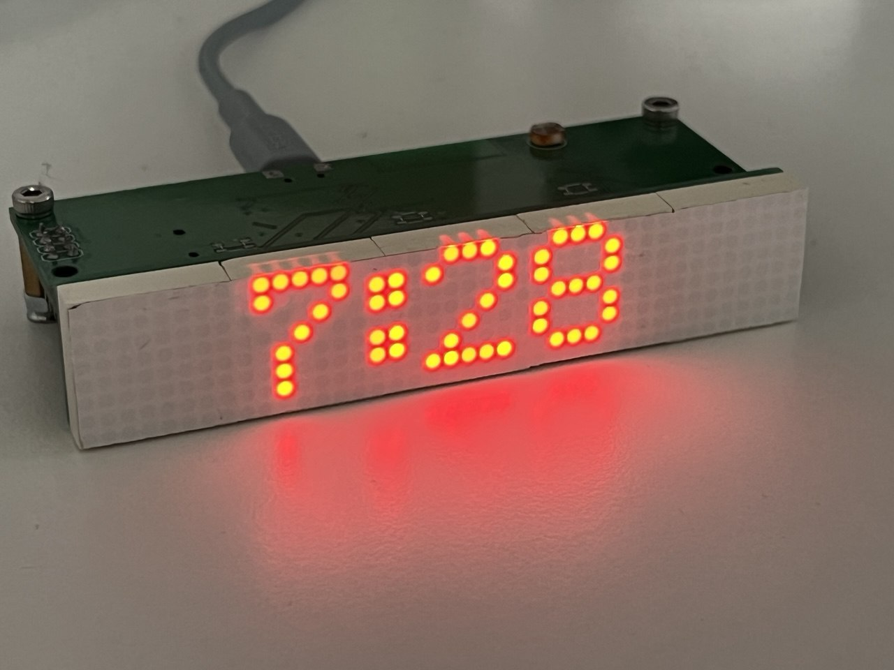

# LED Matrix Clock v3

## Overview
Imagine combining the charm of retro LED displays with modern smart technology. **LED Matrix Clock v3** is a creative DIY project that transforms five 8x8 LED matrices into a sleek timepiece. Powered by an ESP8266 microcontroller, this clock not only displays the current time but also keeps it accurate by syncing with an NTP server. The DS3231 RTC module ensures reliability, while automatic daylight saving adjustments make it smarter than your average clock. Built using the Arduino framework and developed in the PlatformIO environment, this project is a perfect blend of classic aesthetics and cutting-edge convenience.



## Features
- **Time Display**: Shows the current time in the local time zone.
- **Automatic Daylight Calculation**: Adjusts for daylight saving time automatically.
- **NTP Synchronization**: Regular updates to the RTC clock via NTP ensure time accuracy.

## Hardware Requirements
- **ESP8266 (ESP-12 Module)**
- **5 x 8x8 LED Matrices using MAX7219 drivers**
- **DS3231 RTC Module**

## Software Requirements
- **PlatformIO** (installed via Python Pipenv)
- **Arduino Framework**
- **Python 3.x**

## Installation Instructions

### 1. Clone the Repository
```bash
git clone https://github.com/snakeye/matrix-clock-3.git
cd matrix-clock-3
```

### 3. Set Up the Environment
Ensure you have **Python 3.x** installed. Use Pipenv to install PlatformIO and set up the environment:
```bash
pip install pipenv
pipenv install --dev
pipenv shell
```
This command will install PlatformIO and any additional dependencies needed for the project.

### 2. Configure WiFi Connection
Before building the firmware, set up your WiFi connection:
1. Locate the file `src/config.cpp.example` in the repository.
2. Rename the file to `src/config.cpp`:
   ```bash
   mv src/config.cpp.example src/config.cpp
   ```
3. Open `src/config.cpp` in a text editor and update the placeholders with your WiFi network name (SSID) and password:
   ```cpp
   const char* ssid = "YourNetworkName";
   const char* password = "YourNetworkPassword";
   ```

### 4. Build the Firmware
Use the following command within the Pipenv shell to build the firmware:
```bash
platformio run
```

### 5. Upload the Firmware
Ensure your ESP8266 is connected via USB, and upload the firmware using:
```bash
platformio run --target upload
```
Following updates can be performed using OTA. Discover devices' IP address and run the following command:
```bash
platformio run --target upload --upload-port 192.168.1.179
```

## Usage
Once the firmware is uploaded, the clock will start running and display the current time. It will automatically adjust for daylight saving time and periodically synchronize with an NTP server.

## Troubleshooting
- Ensure your ESP8266 module is properly connected and powered.
- If the upload fails, check the USB connection and the selected upload port in `platformio.ini`.
- Verify your Wi-Fi credentials are correctly configured in the `src/config.cpp` file.

## License
This project is licensed under the MIT License. See the LICENSE file for more details.

## Contributions
Contributions are welcome! Please fork the repository and create a pull request with your improvements or fixes.

